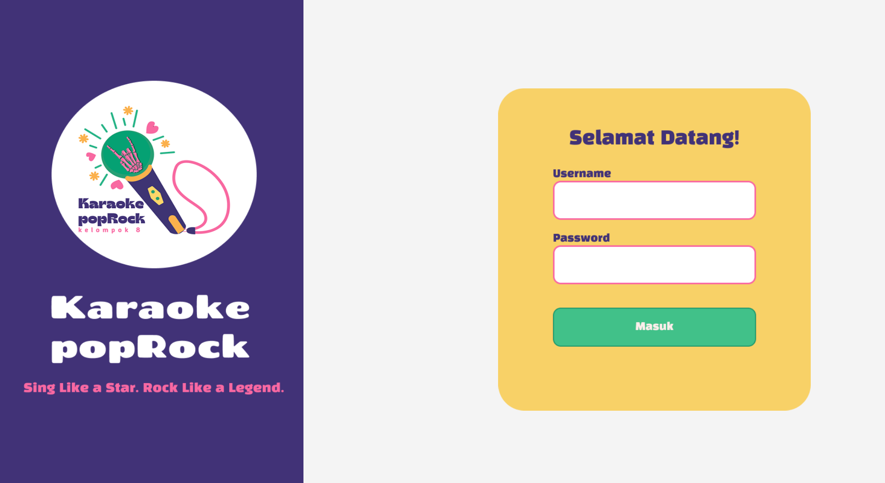

# 🎤 Karaoke PopRock 🎶  
A Java-based Karaoke Management System developed by **Group 8** for the **Pemrograman 3** final project. This system helps karaoke businesses manage their operations smoothly — from room reservations to staff and menu management.

---

## 🖼️ Demo Screenshot

Here’s a preview of the Karaoke PopRock :

---

## 📌 Overview
**Karaoke PopRock** is a modern desktop application built with Java to help manage karaoke business activities. It was created as a final project for **Pemrograman 3** by a passionate student team. The system includes essential features for managing karaoke rooms, customers (members), staff, and menus — all within a simple and intuitive interface.

---

## 👥 Team – Group 8
- 🧑‍💻 **Wildan Yazid Ziddan**
- 👨‍💻 **Rasya Arfian Akbar**
- 👩‍💻 **Anggita Rahma Mutia**
- 👩‍💻 **Letya Asmarani Hidayat**

---

## 🛠️ Built With
- **Java** (Programming Language)
- **JavaFX** (GUI Framework)
- **JDBC** (Database Connectivity)
- **Microsoft SQL Server** (Database)
- **IntelliJ IDEA** (IDE)

---

## 🚀 Features
- 🎵 **Room Management** – Add, edit, and delete karaoke rooms. Monitor room availability.
- 👤 **Member Management** – Register and manage customer data, including loyalty features.
- 🍔 **Menu Management** – Organize food, drinks, and karaoke time packages.
- 🧑‍💼 **Staff Management** – Admin/cashier role-based system.
- 💳 **Transaction Management** – Handle room bookings, payments, and package usage.
- 🔍 **Search & Filter** – Easy navigation through data.
- 🔐 **Login System** – Role-based login for system security.
- 📊 **(Optional)** Reporting system for usage and income logs.
